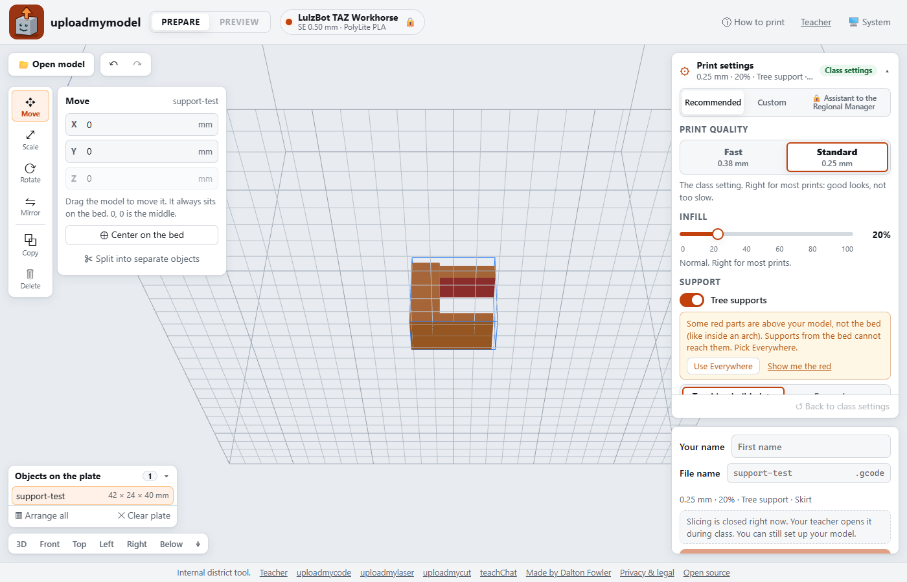
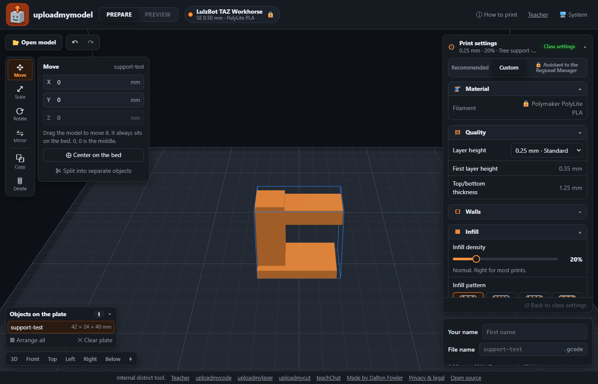

# uploadmymodel

Classroom web slicer for the LulzBot TAZ Workhorse, with teacher-set limits, built for Chromebook
classrooms. Students open a 3D model, set it on the printer bed and pick print settings from short
lists. The school's own CuraEngine slices it, and students save the G-code to an SD card or copy it
onto the printer over USB. Temperatures, speeds and start/end G-code come only from LulzBot's
profile files, never from students.
Internal district tool, sibling of [uploadmycode](https://uploadmycode.com),
[uploadmylaser](https://uploadmylaser.com) and [uploadmycut](https://uploadmycut.com). Made by
[Dalton Fowler](https://daltonjfowler.com).



**Status (2026-09-29):** live at https://uploadmymodel.com with real slicing: the school's
CuraEngine 4.13.2 in a Cloudflare Container (1 vCPU / 3 GiB; a supported Benchy slices in about
15 s). See [PLAN.md](PLAN.md) and [docs/GO_LIVE.md](docs/GO_LIVE.md).

Guides: [students](docs/STUDENT_GUIDE.md) · [teachers](docs/TEACHER_GUIDE.md).

## What students can do

- Open STL, OBJ or 3MF files (or **Try a sample**). Move, rotate, lay flat, mirror, scale, copy
  and split models, with undo. Parts that hang in the air show red, using the student's support
  overhang angle. A **holes** flag marks a damaged file.
- The plate saves itself in the browser, so a reloaded tab gets it back.
- Three settings tabs:
  - **Recommended:** print quality (Fast or Standard), infill, tree supports with the overhang
    angle, and Skirt or Brim.
  - **Custom:** every student setting: Fine detail layers, wall count, infill pattern, where
    supports grow, Raft or None.
  - **Assistant to the Regional Manager:** Custom plus more (custom layer height, first layer
    height, top/bottom thickness, colour change pauses, fuzzy skin, ironing, vase mode and
    others). It unlocks with a password from the teacher.
- Materials: Polymaker PolyLite PLA, PolyLite PETG and PolyFlex TPU95, when the teacher allows
  them. Tree supports are always 0% support infill.
- Students name their G-code file (their name + the model to start). **Save to SD card** opens
  Chrome's save window. **Copy to printer (USB)** writes the file onto the printer's own SD card
  over the USB cable. It does not start the print, and it is slow (about 10 KB/s).
- Preview shows the sliced layers. Opening a `.gcode` file previews it too.



## The teacher page

[/teacher/](https://uploadmymodel.com/teacher/) opens slicing for a class with a class phrase and
a time window, locks settings and sets class defaults, sets the longest print allowed, picks the
materials, turns the USB copy on or off, and shows a note to students. The rest of the site works
without it. While slicing is closed, nothing reaches the slicer.

## Teacher key

The teacher page needs the `TEACHER_KEY` Worker secret. Set or change it with
`npx wrangler secret put TEACHER_KEY` (use a long random key). Wrong guesses lock out only the
device that made them, never the whole school. For local dev, put a throwaway key in `.dev.vars`
(gitignored). The third settings tab uses its own secret, `ARM_KEY`, set the same way. Neither is
ever in this repo.

## Commands

```sh
npm install
npm run build       # web/ → public/ (Vite)
npm run dev         # build, then wrangler dev
npm run dev:web     # Vite dev server; proxies /api to wrangler dev on :8787
npm test            # settings, server and G-code reader checks
npm run test:browser  # ~100 browser checks against npm run dev (needs Chrome)
npm run deploy      # build and deploy to uploadmymodel.com
npm run icons       # redraw icon.svg and the PNG icons into web/public
```

## Credits

3D view and model loading by [three.js](https://threejs.org) and
[three-mesh-bvh](https://github.com/gkjohnson/three-mesh-bvh) (both MIT). Print profiles use
unmodified Cura LulzBot Edition 4.13.2 resource files (LGPL-3.0, see
[engine/res4132/SOURCE.md](engine/res4132/SOURCE.md) and [NOTICE](NOTICE)). The container runs
unmodified CuraEngine (AGPL-3.0, source at https://gitlab.com/lulzbot3d/cura-le/cura-engine-le).

Independent school project. Not affiliated with or endorsed by FAME 3D / LulzBot, UltiMaker (Cura)
or Polymaker. Names are trademarks of their owners.

## License

MIT, see [LICENSE](LICENSE), except the Cura LulzBot Edition files and the data made from them:
see [NOTICE](NOTICE). Third-party notices for the site are in
[web/public/licenses.txt](web/public/licenses.txt).
